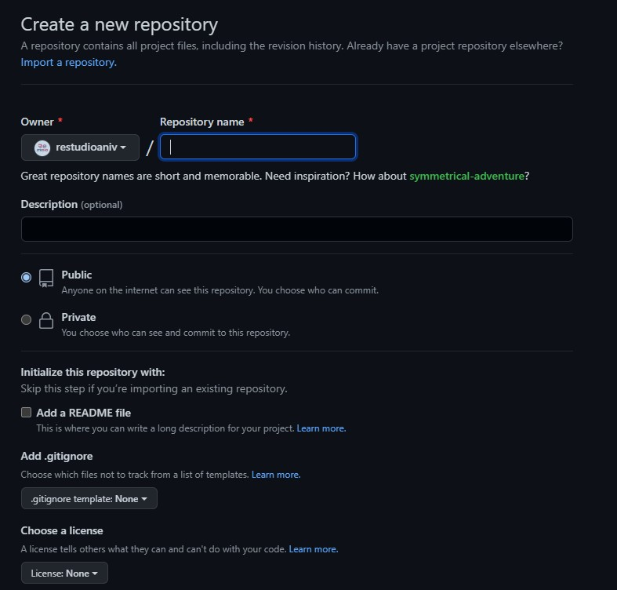
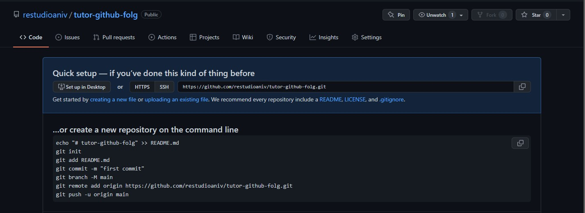

Sebelum membuat repository, pastikan sudah memiliki akun Github terlebih dahulu. Repository ini nantinya akan berfungsi sebagai tempat kita menyimpan dan me-manage source code yang sudah kita buat. Untuk membuatnya sendiri cukup mudah, berikut langkah-langkahnya :

1. Pastikan sudah login ke akun Github
2. Pada halaman dashboard, bisa langsung klik tombol New disebelah kanan

3. Maka akan muncul tampilan seperti berikut 

:::info Informasi
Berikut penjelasan dari form yang tertera:
* Repository name, diisi dengan nama repo yang ingin kita buat, contoh `belajar-github-folg`
* Description, diisi deksripsi repo, untuk kolom deskripsi ini sifatnya opsional, bisa di isi atau dikosongkan
* Tipe repo, pada Github ada 2 tipe repo, yakni Public dan Private :
    * Public, repo kita bisa dilihat dan di cari pada Github
    * Private, repo hanya bisa dilihat oleh si pembuat repo
* Add Readme File, ini bisa di ceklis bisa juga tidak, jika di ceklis maka otomatis akan dibuat file README.md pada repo yang kita buat
* Add .gitignore, jika tidak ingin menambahkan .gitignore, bisa pilih `None`, penjelasan lebih lanjut akan dibuatkan materi tersendiri
* Choose a license, ini digunakan untuk menginformasikan jenis lisensi yang diterapkan pada source code yang kita gunakan, kasus ini biasanya digunakan untuk projek Open Source, jika tidak menggunakan bisa pilih `None`
:::

4. Jika sudah, klik tombol `Create Repository` untuk melanjutkan proses\
5. Maka hasilnya seperti pada gambar berikut, jika Repo sudah berhasil dibuat

