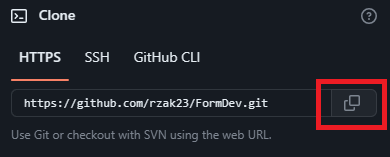

# Clone Repository

Clone Repository adalah istilah untuk men-download (unduh) sebuah repo pada Github. Perintah clone akan digunakan saat kita ingin mengunduh sebuah repo yang ada pada Github untuk disimpan pada device yang kita gunakan, dengan tujuan untuk memodifikasi sebuah file yang ada pada repository yang di clone atau mengerjakan sebuah projek dengan device yang berbeda. Berikut cara clone repository github

1. Buka repository Github yang ingin kita clone
2. Maka kita akan mendapatkan tampilan sebagai berikut

3. Silahkan klik tombol `<> Code`
4. Pada tab HTTPS, makan akan ditampilkan link git repository, silahkan klik icon copy untuk menyalin link tersebut

5. Jika sudah kemudian buka terminal atau cmd pada device yang kita gunakan
6. Silahkan tentukan dan arahkan repository ingin disimpan dimana pada device yang digunakan
7. Ketikan perintah berikut
```bash
git clone <url-git-yang-sudah-disalin>
```
8. Tunggu sampai proses download selesai
9. Jika sudah makan akan otomatis terdapat sebuah folder yang dibuat secara otomatis beserta isi sesuai dengan repository yang ada pada Github
