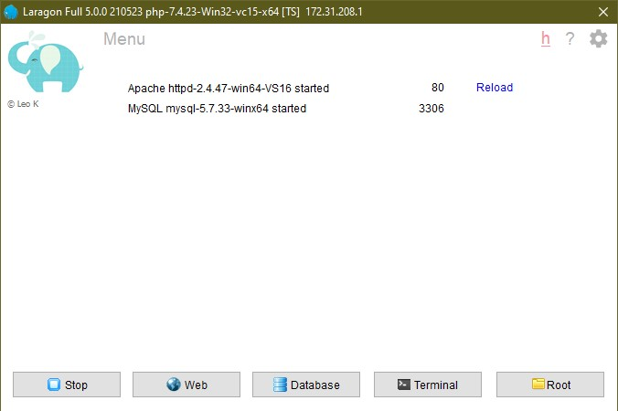
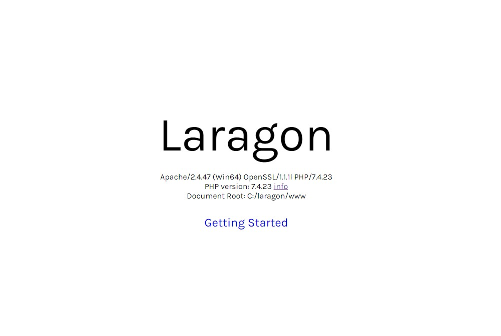

Berikut langkah-langkah menjalankan laragon

1. Buka aplikasi Laragon yang sudah terinstall
2. Klik tombol `Start All`, maka tampilan app seperti berikut

1. Buka browser yang ada pada komputer dan ketikkan url `localhost`, jika sudah tampil seperti gambar dibawah, artinya local server sudah berhasil diinstal dan berjalan pada komputer kita

