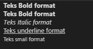

# Pemformatan Teks

Layaknya aplikasi pengolah kata, pada dokumen HTML juga terdapat tesk formatting, dimana format yang sering digunakan adalah bold, italic dan juga underline. Untuk penerapannya tag format ini harus berada di dalam element `<body>`

```html
<b>Teks Bold format</b>
<strong>Teks Bold format</strong>
<i>Teks Italic format</i>
<u>Teks underline format</u>
<small>Teks small format</small>
```

Output :



Penggunaan tag pemformatan ini selain bisa diletakkan di dalam tag `<body>` kita juga bisa mengkombinasakan dengan tag `<p>` dan juga tag `<div>` dan masih banyak beberapa tag yang bisa dikombinasikan