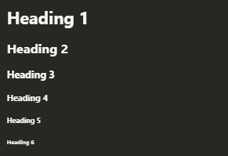

# Heading

Pada pembahasan pertama, kita akan membahas tentang tag heading. Dimana dengan menggunakan tag heading ini kita bisa membuat sebuah judul dengan ukurang yang berbeda-beda tanpa harus memberikan ukuran font secara langsung. Pada HTML terdapat 6 tingkatan dalam heading, untuk lebih jelasnya, silahkan perhatikan syntax berikut

```html
<h1>Heading 1</h1>
<h2>Heading 2</h2>
<h3>Heading 3</h3>
<h4>Heading 4</h4>
<h5>Heading 5</h5>
<h6>Heading 6</h6>
```

Output :



Untuk penggunaan tag heading ini harus diletakan pada element `<body></body>`