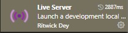

# Pengenalan HTML

HTML (Hypertext Markup Language) merupakan bahasa markup yang digunakan untuk membangun sebuah halaman website, jika diibaratkan kita membangun rumah maka HTML sama dengan pondasi dari sebuah web, tata letak dan dokumen yang ingin ditampilkan pada website akan diletakkan pada elemen-elemen pada HTML. Dalam mempelajari HTML kita akan sering mendengar istilah tag, elemen dan juga atribut.

## Struktur Penulisan HTML

```html
<!DOCTYPE html>
<html>
<head>
    <title>Title</title>
</head>
<body>
    
</body>
</html>
```

Pada struktur HTML diatas bisa kita perhatikan, terdapat 3 element utama :

* Element `<html>`, dimana merupakan element utama dari setiap pembuatan halaman website, elemen ini akan menandakan bahwa sebuah file merupakan dokument HTML
* Element `<head>`, element ini menampung  tag yang berhubungan dengan header dari sebuah alamat, beberapa tag biasa diletakkan pada element `<head>` ini, seperti, `<title>`, `<meta>`,`<link>` dan masih banyak yang lainnya yang akan dibahas secara terpisah
* Element `<body>`, pada element ini kita bisa mengisikan tentang apapun yang ingin kita tampilkan pada halaman web, bedanya dengan element `<head>` adalah jika meletakkan sebuah tag pada element `<head>` maka tidak akan ditampilkan pada halaman web yang kita akses pada sebuah browser, sedangkan jika kita meletakkan sebuah tag pada element `<body>` maka kana dimunculkan dan bisa dilihat pada halaman browser

## Cara Menjalakan dokumen HTML

Yang perlu diperhatikan pertama adalah, kita harus memiliki dokumen dengan format `.html` terlebih dahulu. Jadi pastikan selama mengikuti tutorial pada website ini, silahkan simpan dokument dengan format `.html`.

Untuk menjalannkan dokumen HTML, ada 2 cara :

### Menjalankan Langsung File HTML
Cara pertama adalah menjalankan langsung file HTML, caranya buka Windows Explorer kemudian cari file dokumen HTML yang sudah disimpan dan klik 2x file/dokument HTML, maka secara otomatis akan membuka browser dan menampilkan dokumen HTML yang sudah kita buat

### Menjalankan menggunakan Extension Browser
Cara kedua kali ini menggunakan extension pada browser, dimana yang dibahas pada tutorial ini menggunakan browser dengan basis Chromium Engine seperti, Google Chrome, Micorosft Edge Chromium, dsb. Berikut cara penggunaannya

1. Pastikan sudah buka browser Google Chrome
2. Download extension yang akan digunakan [Web Server Chrome](https://chrome.google.com/webstore/detail/web-server-for-chrome/ofhbbkphhbklhfoeikjpcbhemlocgigb) dan pasang pada browser yang digunakan
3. Buka extension yang sudah di install
4. Pastikan Web Server dalam kondisi `Started`
5. Klik tombol `Choose Folder` dan tentukan folder tempat dimana dokumen HTML disimpan, jika sudah klik tombol `Select Folder`
6. Buka browser dan jalankan local server dengan cara mengetikkan IP web server yang tertera pada extension

### Menggunakan Extensions Visual Studi Code

Jika kalian menggunakan Visual Studio Code, silahkan ikuti langkah berikut :

1. Buka menu Extension pada Visual Studio Code
2. Pada kolom pencarian ketikkan kata `Live Server`
3. Klik pada extension live server

4. Klik tombol Install dan tunggu sampai instalasi selesai
5. Buka dokumen HTML pada Visual Studio Code
6. Klik tombol `Go Live` yang ada pada pojok kanan bawah Visual Studio Code, maka secara otomatis akan membuka browser default pada Windows dan menampilkan dokumen HTML yang kita pilih