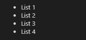

Pada pembahasan kali ini kita akan membahas cara membuat sebuat list pada dokument HTML. Pada dokument HTML terdapat 2 jenis pembuatn order list, pertama numeric list dan yang kedua symbolik list. Untuk lebih jelasnya, silahkan perhatikan syntax berikut :

```html
<ul>
    <li>List 1</li>
    <li>List 2</li>
    <li>List 3</li>
    <li>List 4</li>
</ul>
```

Output :



```html
<ol>
    <li>List 1</li>
    <li>List 2</li>
    <li>List 3</li>
    <li>List 4</li>
</ol>
```

Output :

