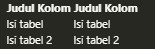
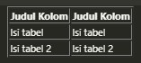

Pada dokument HTML kita juga dapat membuat tabel, untuk membuat tabel kita membutuhkan tag `<table>`. Untuk lebih jelasnya bisa disimak pada contoh syntax berikut 

```html title=tabel.html
<table>
    <thead>
        <tr>
            <th>Judul Kolom</th>
            <th>Judul Kolom</th>
        </tr>
    </thead>
    <tbody>
        <tr>
            <td>Isi tabel</td>
            <td>Isi tabel</td>
        </tr>
        <tr>
            <td>Isi tabel 2</td>
            <td>Isi tabel 2</td>
        </tr>
    </tbody>
</table>
```

Output :



Bisa diperhatikan pada syntax diatas, selain penggunaan tag `<table>` terdapat beberapa tag pendukung untuk membuat sebuah tabel pada dokument HTML.

* Tag `<thead>` digunakan sebagai inisialisasi header dari sebuah tabel
* Tag `<tbody>` digunakan sebagai inisialisasi isi dari sebuah tabel atau tempat dimana data-data akan ditampilkan
* Tag `<tr>` digunakan sebagai penanda dari sebuah baris tabel
* Tag `<th>` memberikan penanda teks sebagai header kolom, secara default teks yang ditampilkan akan dibuat bold atau tebal, sedangkan tag `<td>` digunakan sebagai pengisi data sesuai dengan kolom yang sudah disediakan

Pada contoh diatas kita juga bisa lihat bahwa penggunaan tag `<table>` secara default tidak menampkan garis tabel sebagai pemisah. Dan jika ingin menampilkan garis, maka kita cukup menambahkan attribut `border` di dalam tag `<table>`, berikut contohnya 

```html
<table border="1">
    <thead>
        <tr>
            <th>Judul Kolom</th>
            <th>Judul Kolom</th>
        </tr>
    </thead>
    <tbody>
        <tr>
            <td>Isi tabel</td>
            <td>Isi tabel</td>
        </tr>
        <tr>
            <td>Isi tabel 2</td>
            <td>Isi tabel 2</td>
        </tr>
    </tbody>
</table>
```

Output :

