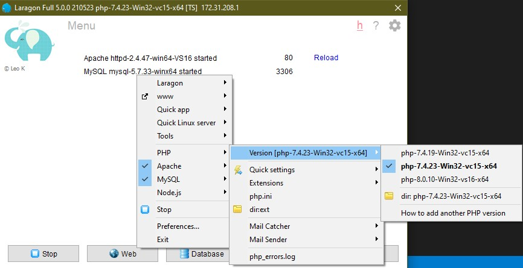

## Menambahkan Versi PHP
Pada Laragon kita dapat menambahkan dan berganti versi PHP pada Laragon dan hal ini yang menjadikan Laragon memiliki kelebihan dari pada aplikasi local server yang lainnya. Berikut langkah-langkah cara menambahkan versi PHP pada aplikasi Laragon :

1. Buka halaman [Windows PHP](https://windows.php.net/download)
2. Download versi PHP yang diinginkan
3. Buka folder php pada lokasi instalasi laragon `C:/laragon/bin/php/`, kemudian buatkan folder sesuai dengan nama versi PHP yang ingin kita tambahkan, misal disini kita menambahkan PHP versi 8, maka buat folder dengan nama `php-8.0.10-Win32-vs16-x64`, untuk lebih mudahnya berikan nama folder sesuai dengan file yang didownload
4. Buka file archive yang sudah di download pada no. 2, dan lakukan proses ekstraksi dengan lokasi tujuan ke folder yang sudah dibuat pada no. 3

## Mengganti Versi PHP

Berikut cara mengganti versi PHP pada Laragon :

1. Buka aplikasi Laragon
2. Klik kanan pada tombol `Web`
3. Arahkan kursor ke PHP
4. Arahkan kursor pada opsi Versi
5. Pilih pada versi yang ingin digunakan

6. Jika sudah klik tombol `Start All` untuk menjalankan local server